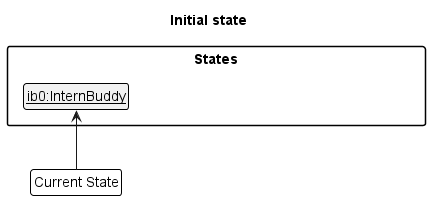
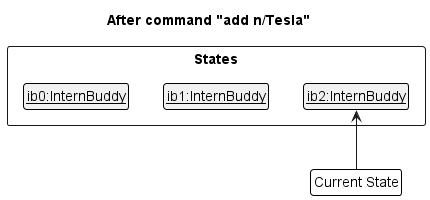
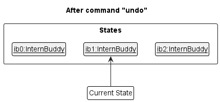
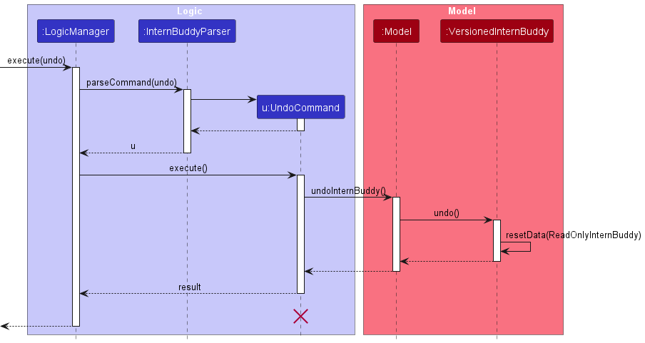
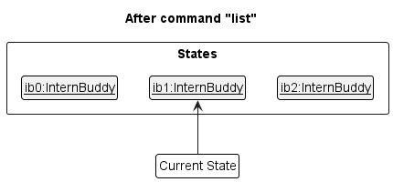
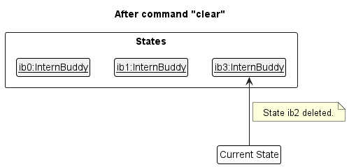

InternBuddy is a desktop application for Computing undergraduates to manage their internship applications.
It is optimized for typing where it allows users to complete internship management tasks much more efficiently
via the keyboard as compared to using traditional Graphical User Interface (GUI) applications. InternBuddy runs
using Java 11, and is available on the Windows, macOS and Linux operating systems.

 

  

* Table of Contents
  {:toc}

## About the Developer Guide
This developer guide aims to provide developers with insights into the implementation details
of InternBuddy and to explain the design considerations behind the different features. It
utilises Unified Modeling Language (UML) diagrams created using [PlantUML](https://plantuml.com/)
for a visual explanation of the implementations.

Apart from shedding light onto InternBuddy's  internal details, this developer guide also provides
information on how one can test the features of InternBuddy, and showcases the user study component
that we went through in the initial development phase for requirements gathering.

Hopefully, interested developers would be able to easily set up the InternBuddy project and
extends its functionality through this developer guide.

## Using the Developer Guide
This developer guide uses a set of formatting standards and syntax to better communicate
information.

### Information Box

:info: **Info:** Provides useful information that supplements the main text

### Tip Box

:bulb: **Tip:**  Suggestions on how to enhance your experience

### Warning Box

:warning: **Warning:**  Warns of a dangerous action that you should be aware of and to consider
carefully before committing

### Code Blocks
Important code-related text and file paths are indicated using syntax highlighting.

`command`, `PARAMETER`, `filepath.json`, `ClassName`

### Keyboard Actions
Keyboard keys are indicated using rounded boxes.

<kbd>Ctrl</kbd> <kbd>Alt</kbd> <kbd>Space</kbd> <kbd>Enter</kbd> <kbd>&uarr;</kbd>

## **Setting up, getting started**

Refer to the guide [_Setting up and getting started_](SettingUp.md) for instructions on how to
set up the InternBuddy project in your personal computer.

## **Design**

:bulb: **Tip:** The `.puml` files used to create diagrams in this document can be found in the [diagrams](https://github.com/AY2223S2-CS2103T-T14-3/tp/tree/master/docs/diagrams) folder. Refer to the [_PlantUML Tutorial_ at se-edu/guides](https://se-education.org/guides/tutorials/plantUml.html) to learn how to create and edit diagrams.

### Architecture

The ***Architecture Diagram*** given above explains the high-level design of the App.

Given below is a quick overview of main components and how they interact with each other.

**Main components of the architecture**

**`Main`** has two classes called [`Main`](https://github.com/AY2223S2-CS2103T-T14-3/tp/blob/master/src/main/java/seedu/address/Main.java) and [`MainApp`](https://github.com/AY2223S2-CS2103T-T14-3/tp/blob/master/src/main/java/seedu/address/MainApp.java). It is responsible for,
* At app launch: Initializes the components in the correct sequence, and connects them up with each other.
* At shut down: Shuts down the components and invokes cleanup methods where necessary.

[**`Commons`**](#common-classes) represents a collection of classes used by multiple other components.

The rest of the App consists of four components.

* [**`UI`**](#ui-component): The UI of the App.
* [**`Logic`**](#logic-component): The command executor.
* [**`Model`**](#model-component): Holds the data of the App in memory.
* [**`Storage`**](#storage-component): Reads data from, and writes data to, the hard disk.

**How the architecture components interact with each other**

The *Sequence Diagram* below shows how the components interact with each other for the scenario where the user issues the command `delete 1`.

Each of the four main components (also shown in the diagram above),

* defines its *API* in an `interface` with the same name as the Component.
* implements its functionality using a concrete `{Component Name}Manager` class (which follows the corresponding API `interface` mentioned in the previous point.

For example, the `Logic` component defines its API in the `Logic.java` interface and implements its functionality using the `LogicManager.java` class which follows the `Logic` interface. Other components interact with a given component through its interface rather than the concrete class (reason: to prevent outside component's being coupled to the implementation of a component), as illustrated in the (partial) class diagram below.

The sections below give more details of each component.

### UI component

The **API** of this component is specified in [`Ui.java`](https://github.com/AY2223S2-CS2103T-T14-3/tp/blob/master/src/main/java/seedu/address/ui/Ui.java)

The UI consists of a `MainWindow` that is made up of parts e.g.`CommandBox`, `ResultDisplay`,
`InternshipListPanel`, `StatusBarFooter` etc. All these, including the `MainWindow`,
inherit from the abstract `UiPart` class which captures the commonalities between classes that
represent parts of the visible GUI.

The `UI` component uses the JavaFx UI framework. The layout of these UI parts are defined in matching
`.fxml` files that are in the `src/main/resources/view` folder. For example, the layout of the
[`MainWindow`](https://github.com/AY2223S2-CS2103T-T14-3/tp/blob/master/src/main/java/seedu/address/ui/MainWindow.java)
is specified in [`MainWindow.fxml`](https://github.com/AY2223S2-CS2103T-T14-3/tp/blob/master/src/main/resources/view/MainWindow.fxml)

The `UI` component,

* executes user commands using the `Logic` component.
* listens for changes to `Model` data so that the UI can be updated with the modified data.
* keeps a reference to the `Logic` component, because the `UI` relies on the `Logic` to execute commands.
* depends on some classes in the `Model` component, as it displays `Internship` object residing in the `Model`.

### Logic component

**API** : [`Logic.java`](https://github.com/AY2223S2-CS2103T-T14-3/tp/blob/master/src/main/java/seedu/address/logic/Logic.java)

Here's a (partial) class diagram of the `Logic` component:

How the `Logic` component works:
1. When `Logic` is called upon to execute a command, it uses the `AddressBookParser` class to parse the user command.
1. This results in a `Command` object (more precisely, an object of one of its subclasses e.g., `AddCommand`) which is executed by the `LogicManager`.
1. The command can communicate with the `Model` when it is executed (e.g. to add a person).
1. The result of the command execution is encapsulated as a `CommandResult` object which is returned back from `Logic`.

The Sequence Diagram below illustrates the interactions within the `Logic` component for the `execute("delete 1")` API call.

:information_source: **Note:** The lifeline for `DeleteCommandParser` should end at the destroy marker (X) but due to a limitation of PlantUML, the lifeline reaches the end of diagram.

Here are the other classes in `Logic` (omitted from the class diagram above) that are used for parsing a user command:

How the parsing works:
* When called upon to parse a user command, the `InternBuddyParser` class creates an `XYZCommandParser`
(`XYZ` is a placeholder for the specific command name e.g., `AddCommandParser`) which uses the other classes
shown above to parse the user command and create a `XYZCommand` object (e.g., `AddCommand`) which the
`InternBuddyParser` returns back as a `Command` object.
* All `XYZCommandParser` classes (e.g., `AddCommandParser`, `DeleteCommandParser`, ...) inherit from
the `Parser` interface so that they can be treated similarly where possible e.g, during testing.

### Model component
**API** : [`Model.java`](https://github.com/AY2223S2-CS2103T-T14-3/tp/blob/master/src/main/java/seedu/address/model/Model.java)

The `Model` component,

* stores the internsip data i.e., all `Internship` objects (which are contained in a `UniqueInternshipList` object).
* stores the currently 'selected' `Internship` objects (e.g., results of a search query) as a separate _filtered_ list
which is exposed to outsiders as an unmodifiable `ObservableList<Internship>` that can be 'observed'
(e.g. the UI can be bound to this list so that the UI automatically updates when the data in the list change.).
* stores a `UserPref` object that represents the user’s preferences. This is exposed to the outside as a `ReadOnlyUserPref` objects.
* does not depend on any of the other three components (as the `Model` represents data entities of the domain, they should make sense on their own without depending on other components)

:information_source: **Note:** An alternative (arguably, a more OOP)
model is given below. It has a `Tag` list in the `InternBuddy`, which `Internship` references. This allows `InternBuddy`
to only require one `Tag` object per unique tag, instead of each `Internship` needing their own `Tag` objects. 

### Storage component

**API** : [`Storage.java`](https://github.com/AY2223S2-CS2103T-T14-3/tp/blob/master/src/main/java/seedu/address/storage/Storage.java)

The `Storage` component,
* can save both internship data and user preference data in json format, and read them back into corresponding objects.
* inherits from both `InternBuddyStorage` and `UserPrefStorage`, which means it can be treated as either one (if only the functionality of only one is needed).
* depends on some classes in the `Model` component (because the `Storage` component's job is to save/retrieve objects that belong to the `Model`)

### Common classes

Classes used by multiple components are in the `seedu.addressbook.commons` package.

--------------------------------------------------------------------------------------------------------------------

## **Implementation**

This section describes some noteworthy details on how certain features are implemented.

### Add Feature

#### Implementation
The following sequence diagram provides an overview on how the `add` operation works.

The following gives a more detailed explanation of the `add` operation.
######  Step 1: Validate Input
1. When the user enters an `add` command, the `AddCommandParser` parses the user's input.
2. It checks for the following:
- `n/` followed by the company's name [Compulsory]
- `r/` followed by the role applied [Compulsory]
- `s/` followed by the status of the internship application [Compulsory]
- `d/` followed by the date associated with the entry [Compulsory]
- `c/` followed by the comment for the entry [Optional]
- `t/` followed by tags for the entry [Optional]
3. If any of the compulsory fields is missing or any of the fields entered by the user
   does not meet the parameter requirements, a `ParserException` will be thrown.
4. An `Internship` will be created from the parsed user's input.

###### Step 2: Adding the Internship
5. A check is done to see if the `Model` component, which stores all the `Internship` entries,
   contains the `Internship` created in Step 4.
6. If a duplicate `Internship` is found, a `CommandException` will be thrown.
7. Else if there is no duplicate `Internship`, the `Internship` created will be added into
   the `Model` component.
8. The currently selected `Internship` in the `Model` component will be updated to become
   this new `Internship` such that the right UI panel displays the information for this new
   `Internship`.

#### Design Considerations

###### Whether to make all fields in the `add` command compulsory
1. **Alternative 1 (chosen): Make only essential fields compulsory**
    * Pros: More user-centric as not all users want to enter the optional information,
            which is not exactly critical in tracking internships.
    * Cons: More work is to be done in code implementation. For example, the absence of optional
            fields should not cause a `ParseException`, and there is a need to include a
            default value of `NA` for input without any `Comment`.
2. **Alternative 2: Make all fields compulsory**
    * Pros: Easier to implement as there is no need to differentiate between compulsory
            and optional fields during command parsing, and it is easier to compare between
            different `Internship` since we just require an exact match of all fields.
    * Cons: Less user-centric where users who do not want to include `Comment` and `Tag`
            are forced to input something for the `Add` command to work.

###### Whether to update the right UI panel according to the `add` command

1. **Alternative 1 (chosen): Update the right panel whenever a new `Internship` is added**
    * Pros: Better visual indication that the `add` command has been successfully executed.
      if the user has  a lot of `Internship` entries, when a new `Internship` is added,
      the new entry will be placed at the bottom of the left UI panel, which is not visible
      if the user's scroll position is at the top of the left UI panel. Therefore, updating
      the right panel enhances visual indication to the user that the `Internship` has been
      successfully added.
    * Cons: An additional line of code is required in the `execute` method of `AddCommand`
      to update the selected `Internship` in the `Model` component in order to update
      the right panel.

2. **Alternative 2: Do not update the right panel when a new `Internship` is added**
    * Pros: No additional code is required in the `execute` method of `AddCommand`.
    * Cons: When the user has a lot of `Internship` entries, the added entry in the left
      UI panel may not be visible since it is added to the bottom. Without scrolling, users
      have to rely on the Results Display box to determine if the `AddCommand` is successful.

### View Feature

#### Implementation
The following sequence diagram provides an overview on how the `view` operation works.

The following gives a more detailed explanation of the `view` operation.
######  Step 1: Validate Input
1. When the user enters a `view` command, the `ViewCommandParser` parses the user's input.
2. It checks for the following:
- The `INDEX` entered by the user must be able to be converted into a numeric index.
3. If the user entered a value of `INDEX` that cannot be converted, a `ParserException` will
   be thrown.
4. An `Index` will be created from the user's input if Step 2 passes.

###### Step 2: Viewing the Internship
5. A check is done to see if the `Index` created in Step 4 is a valid index given the number
   of `Internship` entries in the filtered `Internship` list of the `Model` component.
6. If the `Index` is invalid, a `CommandException` will be thrown.
7. Else if the `Index` is valid, the `Internship` which belongs to that `Index` will be
   retrieved by accessing the filtered `Internship` list.
8. The currently selected `Internship` in the `Model` component will be updated to become
   the `Internship` obtained from Step 7 such that the right UI panel displays the information
   for this selected `Internship`.

#### Design Considerations

###### Whether to separate the checking of valid user input into 2 classes
1. **Alternative 1: Allow `ViewCommand` to handle checking of whether user input can be
   parsed into an index, and whether it is a valid index**
    * Pros: No need for a separate `ViewCommandParser` class and any problems with checking of
      user input can be isolated to the `ViewCommand` class.
    * Cons: Breaks the abstraction where parsing of user input should be done by the `Parser`
      classes instead of a `Command` class.
2. **Alternative 2 (chosen): Allow `ViewCommandParser` to handle checking of whether user input
   can be parsed into an index, and `ViewCommand` to handle checking of whether it
   is a valid index**
    * Pros: Maintains the abstraction between the `Parser` and `Command` classes. Also, it
      makes it more maintainable for future extensions in the event that further checks
      to the user input are required.
    * Cons: Have to maintain code in 2 separate classes and in the event that there
      is an issue in processing user input for the `ViewCommand`, there is a need to
      identify and isolate which of the 2 checks does the problem originate from.

### \[Proposed\] Undo/redo feature

#### Proposed Implementation

The proposed undo/redo mechanism is facilitated by `VersionedAddressBook`. It extends `AddressBook` with an undo/redo history, stored internally as an `addressBookStateList` and `currentStatePointer`. Additionally, it implements the following operations:

* `VersionedAddressBook#commit()` — Saves the current address book state in its history.
* `VersionedAddressBook#undo()` — Restores the previous address book state from its history.
* `VersionedAddressBook#redo()` — Restores a previously undone address book state from its history.

These operations are exposed in the `Model` interface as `Model#commitAddressBook()`, `Model#undoAddressBook()` and `Model#redoAddressBook()` respectively.

Given below is an example usage scenario and how the undo/redo mechanism behaves at each step.

Step 1. The user launches the application for the first time. The `VersionedAddressBook` will be initialized with the initial address book state, and the `currentStatePointer` pointing to that single address book state.

Step 2. The user executes `delete 5` command to delete the 5th person in the address book. The `delete` command calls `Model#commitAddressBook()`, causing the modified state of the address book after the `delete 5` command executes to be saved in the `addressBookStateList`, and the `currentStatePointer` is shifted to the newly inserted address book state.

Step 3. The user executes `add n/David …​` to add a new person. The `add` command also calls `Model#commitAddressBook()`, causing another modified address book state to be saved into the `addressBookStateList`.

:information_source: **Note:** If a command fails its execution, it will not call `Model#commitAddressBook()`, so the address book state will not be saved into the `addressBookStateList`.

Step 4. The user now decides that adding the person was a mistake, and decides to undo that action by executing the `undo` command. The `undo` command will call `Model#undoAddressBook()`, which will shift the `currentStatePointer` once to the left, pointing it to the previous address book state, and restores the address book to that state.

:information_source: **Note:** If the `currentStatePointer` is at index 0, pointing to the initial AddressBook state, then there are no previous AddressBook states to restore. The `undo` command uses `Model#canUndoAddressBook()` to check if this is the case. If so, it will return an error to the user rather
than attempting to perform the undo.

The following sequence diagram shows how the undo operation works:

:information_source: **Note:** The lifeline for `UndoCommand` should end at the destroy marker (X) but due to a limitation of PlantUML, the lifeline reaches the end of diagram.

The `redo` command does the opposite — it calls `Model#redoAddressBook()`, which shifts the `currentStatePointer` once to the right, pointing to the previously undone state, and restores the address book to that state.

:information_source: **Note:** If the `currentStatePointer` is at index `addressBookStateList.size() - 1`, pointing to the latest address book state, then there are no undone AddressBook states to restore. The `redo` command uses `Model#canRedoAddressBook()` to check if this is the case. If so, it will return an error to the user rather than attempting to perform the redo.

Step 5. The user then decides to execute the command `list`. Commands that do not modify the address book, such as `list`, will usually not call `Model#commitAddressBook()`, `Model#undoAddressBook()` or `Model#redoAddressBook()`. Thus, the `addressBookStateList` remains unchanged.

Step 6. The user executes `clear`, which calls `Model#commitAddressBook()`. Since the `currentStatePointer` is not pointing at the end of the `addressBookStateList`, all address book states after the `currentStatePointer` will be purged. Reason: It no longer makes sense to redo the `add n/David …​` command. This is the behavior that most modern desktop applications follow.

The following activity diagram summarizes what happens when a user executes a new command:

#### Design considerations:

**Aspect: How undo & redo executes:**

* **Alternative 1 (current choice):** Saves the entire address book.
    * Pros: Easy to implement.
    * Cons: May have performance issues in terms of memory usage.

* **Alternative 2:** Individual command knows how to undo/redo by
  itself.
    * Pros: Will use less memory (e.g. for `delete`, just save the person being deleted).
    * Cons: We must ensure that the implementation of each individual command are correct.

_{more aspects and alternatives to be added}_

### \[Proposed\] Data archiving

_{Explain here how the data archiving feature will be implemented}_

### Edit feature

#### Implementation

The following sequence diagram shows how the edit operation works:

:information_source: **Note:** The lifeline for `EditCommandParser` should end at the destroy marker (X) but due to a limitation of PlantUML, the lifeline reaches the end of diagram.

The following is a more detailed explanation on how `EditCommand` works.

1. When the user enters an `edit` command, the `EditCommandParser` parses the user's input.
2. If the internship index specified is invalid, a `ParserException` will be thrown and the specified `Internship` will not be edited.
3. If the name, role, status, tag, date or comment fields are missing (at least one must be present) or invalid, a `ParserException` will be thrown and the Internship will not be edited.
4. After the successful parsing of user input into `EditCommandParser`, the `EditCommand` object is created with a new updated `Internship` object (to maintain immutability).
5. Following which, `EditCommand#execute(Model model)` method is called which eventually calls the `Model#setInternship(Internship toEdit, Internship edited)` method, replacing the old `Internship` object with the newly updated one.

#### Design considerations:

**Aspect: How edit executes:**

* **Alternative 1 (current choice):** Edit command will create a new `Internship` to replace the existing `Internship` object.
    * Pros: 
      * Maintains immutability of `Internship` class
    * Cons: 
      * May be less efficient than alternative 2

* **Alternative 2:** Edit command will directly edit the `internship` by modifying its attributes
    * Pros: 
      * Will use less memory (no new `internship` object will be created). 
      * Saves time since there is no need to create the new object.
    * Cons: 
      * Reduces the defensiveness of the code and class

_{more aspects and alternatives to be added}_

### Find feature

#### Implementation

The following sequence diagram shows how the find operation works:

The following is a more detailed explanation on how 'FindCommand' works.

1. If the name, role, status, date or tag fields are missing (at least one must be present) or invalid, a `ParserException` will be thrown and the `FindCommand` will not be executed.
2. After the successful parsing of user input into `FindCommandParser`, an `InternshipContainsKeywordPredicate` object, containing the lists of keywords specified in the user input, is created, which in turn is used to create a `FindCommand` object.
3. Following which, the `FindCommand#execute(Model model)` method is called which eventually calls the `updateFilteredInternshipList(Predicate<Internship> predicate)` method with the `InternshipContainsKeywordPredicate` object, previously created by `FindCommandParser`, as its argument and updates the `FilteredList<Internship>` stored inside the `Model`.

### Design Considerations

**Aspect: How find command uses user input:**

* **Alternative 1 (current choice):** Find internship by exact match of user input and `Internship` object's corresponding attributes
    * Pros:
        * Instructions on how to use the find command will be clear and easily communicated to user
    * Cons:
        * Very restrictive for user (e.g. an internship with the name "Google Ltd" will not turn up for the find command "find n/Google")

* **Alternative 2:** Find internship by match of user input and `Internship` object's attributes' corresponding attributes' substrings
    * Pros:
        * Command is much more flexible (e.g. an internship with the name "Google" will turn up for the find command "find n/goo")
    * Cons:
        * May be confusing for user (e.g. user assumes find command works for matching substrings of individual words and inputs "find n/goo inc" for an `Internship` object named "Google Incorporated")

* **Alternative 3:** Find internship by match of any word of user input and any word of `Internship` object's corresponding attributes
    * Pros:
        * Command is much more flexible
    * Cons:
        * Command becomes too flexible (e.g. a find command like "find n/google ltd" will return `Internship` objects that not just has the word "Google", like "Google Ltd", in their names but "ltd" as well, like "Apple Ltd", "Meta Ltd" and more)

### Upcoming Feature

#### Implementation
The following sequence diagram provides an overview on how the `upcoming` operation works.

The following gives a more detailed explanation of the `upcoming` operation.
1. When the user enters an `upcoming` command, a `UpcomingCommand` object is created.
3. Following which, the `UpcomingCommand#execute(Model model)` method is called which eventually calls the`updateFilteredInternshipList(Predicate<Internship> predicate)` method with the `InternshipU` object as its argument and updates the `FilteredList<Internship>` stored inside the `Model`.
   

#### Design Considerations

###### Whether to make all fields in the `add` command compulsory
1. **Alternative 1 (chosen): Make only essential fields compulsory**
    * Pros: More user-centric as not all users want to enter the optional information,
      which is not exactly critical in tracking internships.
    * Cons: More work is to be done in code implementation. For example, the absence of optional
      fields should not cause a `ParseException`, and there is a need to include a
      default value of `NA` for input without any `Comment`.
2. **Alternative 2: Make all fields compulsory**
    * Pros: Easier to implement as there is no need to differentiate between compulsory
      and optional fields during command parsing, and it is easier to compare between
      different `Internship` since we just require an exact match of all fields.
    * Cons: Less user-centric where users who do not want to include `Comment` and `Tag`
      are forced to input something for the `Add` command to work.

###### Whether to update the right UI panel according to the `add` command

1. **Alternative 1 (chosen): Update the right panel whenever a new `Internship` is added**
    * Pros: Better visual indication that the `add` command has been successfully executed.
      if the user has  a lot of `Internship` entries, when a new `Internship` is added,
      the new entry will be placed at the bottom of the left UI panel, which is not visible
      if the user's scroll position is at the top of the left UI panel. Therefore, updating
      the right panel enhances visual indication to the user that the `Internship` has been
      successfully added.
    * Cons: An additional line of code is required in the `execute` method of `AddCommand`
      to update the selected `Internship` in the `Model` component in order to update
      the right panel.

2. **Alternative 2: Do not update the right panel when a new `Internship` is added**
    * Pros: No additional code is required in the `execute` method of `AddCommand`.
    * Cons: When the user has a lot of `Internship` entries, the added entry in the left
      UI panel may not be visible since it is added to the bottom. Without scrolling, users
      have to rely on the Results Display box to determine if the `AddCommand` is successful.

_{more aspects and alternatives to be added}_

--------------------------------------------------------------------------------------------------------------------

## **Documentation, logging, testing, configuration, dev-ops**

* [Documentation guide](Documentation.md)
* [Testing guide](Testing.md)
* [Logging guide](Logging.md)
* [Configuration guide](Configuration.md)
* [DevOps guide](DevOps.md)

--------------------------------------------------------------------------------------------------------------------

## **Appendix: Requirements**

### Product scope

**Target user profile:**
Computing Undergraduates

**Characteristics of user profile:**
* Has a need to manage many internship applications

Internships form an integral part of the undergraduate curriculum for Computing Undergraduates. In a technical field
like Computing, it is especially important for undergraduates to practice what they have learnt in classrooms.
However, given the tight competition in the market, many undergraduates source for numerous internship opportunities
before being accepted for one. Therefore, many Computing undergraduates face the need to track many applications
where each could be in a different phase of the application process.

* Prefers typing to mouse interactions, with good typing speed

Computing undergraduates have great exposure to computer usage where coding assignments and projects in school require
extensive typing. This justifies a sufficiently good level of proficiency with regard to typing. In fact, with the
existence of keyboard shortcuts, many programmers prefer typing over using the mouse because of the efficiency gains.

* Reasonably comfortable in using Command Line Interface (CLI) apps

CLI provides a simple way to interact with computers to run programs and manage files.
Computing undergraduates are taught how to use the CLI in their curriculums, and are often required to use it
to run system tasks that cannot be done over the GUI. Hence, this would imply a reasonable level of comfort in using
the CLI interface.

* Prefers desktop applications over other types

**Value proposition**:

InternBuddy aims to provide a 1-stop platform for a computing undergraduate to view and
manage his internship applications. Consolidating internship information, the application provides organisational
capabilities for easy tracking and follow-ups while eliminating the need to handle data across multiple platforms.

### User stories

Priorities: High (must have) - `* * *`, Medium (nice to have) - `* *`, Low (unlikely to have) - `*`

| Priority | As a …​                                                                                     | I want to …​                                                     | So that I can…​                                                                                     |
|----------|---------------------------------------------------------------------------------------------|------------------------------------------------------------------|-----------------------------------------------------------------------------------------------------|
| `* * *`  | Computing undergraduate with many internship applications                                   | list out all the entries                                         | browse through my list of applications.                                                             |
| `* * *`  | Computing undergraduate applying for many internships                                       | add a new entry                                                  | manage new applications using InternBuddy.                                                          |
| `* * *`  | Computing undergraduate managing many concurrent internship applications                    | add a status to each entry                                       | track the status of each application.                                                               |
| `* * *`  | Computing undergraduate who is planning to track internship applications in the long run    | delete entries                                                   | remove outdated or irrelevant entries from InternBuddy.                                             |
| `* * *`  | Computing undergraduate who is planning to track internship applications in the long run    | store data                                                       | resume from where I left off in my previous run of InternBuddy.                                     |
| `* * *`  | Computing undergraduate who is a new user of InternBuddy                                    | view the list of supported commands                              | refer to it when I am unsure about the usage of InternBuddy.                                        |
| `* *`    | meticulous Computing undergraduate                                                          | be notified that InternBuddy is exiting                          | be rest assured that InternBuddy has successfully terminated when I exit it.                        |
| `* *`    | careless Computing undergraduate                                                            | modify the details of an entry                                   | correct my typos without having to create a new entry from scratch.                                 |
| `* *`    | careless Computing undergraduate                                                            | be prompted with a confirmation message before I delete an entry | avoid accidental deletes.                                                                           |
| `* *`    | forgetful Computing undergraduate                                                           | rely on auto-saving of data                                      | avoid the problem of forgetting to save my entries when I make changes to them.                     |
| `* *`    | Computing undergraduate applying for technical roles                                        | tag each entry with its associated tech stack                    | identify the technical requirements associated with each application.                               |
| `* *`    | Computing undergraduate applying for technical roles                                        | filter internship entries by tags                                | narrow down the search to internship applications with the tech stack that I would like to work on. |
| `* *`    | Computing undergraduate with many internship applications                                   | search an entry by name                                          | easily and swiftly locate the desired application entry.                                            |
| `* *`    | Computing undergraduate who is not extremely proficient with the command line interface     | have intuitive and simple-to-pick-up commands                    | use InternBuddy without much technical difficulties.                                                |
| `* * `   | detail-oriented Computing undergraduate                                                     | add custom remarks to each entry                                 | have the flexibility of documenting miscellaneous but relevant information.                         |
| `*`      | Computing undergraduate who is slow in learning                                             | go through a step-by-step in-app tutorial                        | learn how to use InternBuddy in a guided and self-paced environment.                                |
| `*`      | Computing undergraduate managing many concurrent internship applications                    | filter internship entries by date                                | identify the upcoming tasks or deadlines.                                                           |
| `*`      | Computing undergraduate managing many concurrent internship applications                    | obtain reminders                                                 | avoid forgetting about upcoming tasks or deadlines.                                                 |
| `*`      | analytical Computing undergraduate                                                          | have a summary overview of all the entries                       | analyse the composition of the entries, such as what percentage of applications were successful.    |
| `*`      | Computing undergraduate who is planning to track internship applications in the long run    | archive old entries                                              | delete them from InternBuddy while maintaining a backup copy of the outdated data.                  |
| `*`      | Computing undergraduate who is experienced in using InternBuddy                             | have shortcuts to existing commands                              | carry out tasks in InternBuddy even more efficiently than previously.                               |

### Use cases

(For all use cases below, the **System** is `InternBuddy` and the **Actor** is the `user`, unless specified otherwise)

**Use case: Add an internship entry**

**MSS**

1.  User enters internship entry
2.  InternBuddy adds an internship entry and displays success message

    Use case ends.

**Extensions**

* 1a.  InternBuddy detects one or more fields are missing.
    * 1a1. InternBuddy requests for internship entry with correct format.
    * 1a2. User enters corrected internship entry.
    * Steps 1a1-1a2 are repeated until the internship entry entered is of the correct format.

      Use case ends.

* 1b.  InternBuddy detects one or more fields have invalid parameters.
    * 1b1. InternBuddy requests for internship entry with correct format.
    * 1b2. User enters corrected internship entry.
    * Steps 1b1-1b2 are repeated until the internship entry entered is of the correct format.

      Use case ends.

**Use Case: Edit an internship entry**

**MSS**

1.  User edits an internship entry
2.  InternBuddy updates that particular internship entry and displays success message

    Use case ends.

**Extensions**

* 1a. InternBuddy detects missing field.
    * 1a1. InternBuddy prompts user for edit command of correct format.

      Use case resumes from Step (1).

* 1b. InternBuddy detects one or more fields has invalid parameters.
    * 1b1. InternBuddy prompts user for edit command of correct format.

      Use case resumes from Step (1).

**Use case: Display list of all internship applications on InternBuddy.**

**MSS**

1.  User requests for the list
2.  InternBuddy displays a list of all the internship entries

    Use case ends.

**Use case: Exit InternBuddy**

**MSS**

1.  User requests to exit InternBuddy
2.  InternBuddy displays exit message and closes the application

    Use case ends.

*{More to be added}*

### Non-Functional Requirements

1.  Should work on any _mainstream OS_ as long as it has Java `11` or above installed.
2.  Should be able to hold up to 500 internship entries without a noticeable sluggishness in performance for typical usage.
3.  Should be able to respond to user input within 6 seconds.
3.  A Computing undergraduate student with above average typing speed for regular English text (i.e. not code, not system admin commands) should be able to accomplish most of the tasks faster using commands than using the mouse.
4.  Should be easily adopted by most Computing undergraduates students who have never used command line applications to track internships before.
5.  The user guide should be clear enough such that most Computing undergraduates know how to use the core features of InternBuddy after reading the the user guide.
6.  The developer guide should be clear enough such that new developers are able to understand how the system is designed, and know how to contribute to the codebase after reading the guide.
7.  InternBuddy is not required to handle concurrent users.
8.  InternBuddy is not required to make data available online.

### Glossary

* **Mainstream OS**: Windows, Linux, Unix, OS-X
* **Computing undergraduate**: Refers to a university undergraduate pursuing a Computing degree.
* **Tech stack**: Refers to a set of technologies that a company uses to create or maintain a software system or product.
--------------------------------------------------------------------------------------------------------------------

## **Appendix: Instructions for manual testing**

Given below are instructions to test the app manually.

:information_source: **Note:** These instructions only provide a starting point for testers to work on;
testers are expected to do more *exploratory* testing.

### Launch and shutdown

1. Initial launch

    1. Download the jar file and copy into an empty folder

    1. Double-click the jar file Expected: Shows the GUI with a set of sample contacts. The window size may not be optimum.

1. Saving window preferences

    1. Resize the window to an optimum size. Move the window to a different location. Close the window.

    1. Re-launch the app by double-clicking the jar file. 
       Expected: The most recent window size and location is retained.

1. _{ more test cases …​ }_

### Deleting a person

1. Deleting a person while all persons are being shown

    1. Prerequisites: List all persons using the `list` command. Multiple persons in the list.

    1. Test case: `delete 1` 
       Expected: First contact is deleted from the list. Details of the deleted contact shown in the status message. Timestamp in the status bar is updated.

    1. Test case: `delete 0` 
       Expected: No person is deleted. Error details shown in the status message. Status bar remains the same.

    1. Other incorrect delete commands to try: `delete`, `delete x`, `...` (where x is larger than the list size) 
       Expected: Similar to previous.

1. _{ more test cases …​ }_

### Saving data

1. Dealing with missing/corrupted data files

    1. _{explain how to simulate a missing/corrupted file, and the expected behavior}_

1. _{ more test cases …​ }_

## **Acknowledgements**

* InternBuddy is written in **Java 11**, with usage of the [JavaFX](https://openjfx.io/),
  [Jackson](https://github.com/FasterXML/jackson), [JUnit5](https://github.com/junit-team/junit5)
  and [TestFX](https://github.com/TestFX/TestFX) libraries. It
  is adapted from the [AddressBook Level 3](https://github.com/se-edu/addressbook-level3) project created by
  the [SE-EDU initiative](https://se-education.org).
* InternBuddy also utilises code adapted from [AddressBook Level 4](https://github.com/se-edu/addressbook-level4)
  and [Please Hire Us](https://github.com/AY2223S1-CS2103T-W17-4/tp) primarily for the purpose of GUI testing.
