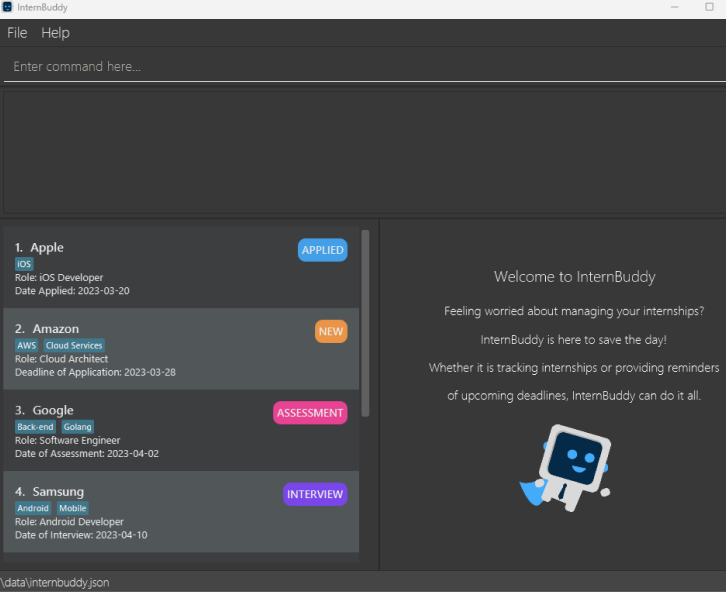

 

InternBuddy is a desktop application for Computing undergraduates to manage their internship applications. It is
optimized for typing where it allows you to complete internship management tasks much more efficiently via
the keyboard as compared to using traditional Graphical User Interface (GUI) applications. If you are a fast
typist who is seeking for a one-stop platform to systematically organise your internship applications,
then InternBuddy is the perfect buddy to accompany you during your internship hunt.

InternBuddy runs using Java 11, and is available on the Windows, macOS and Linux operating systems.

* If you are interested in using InternBuddy, head over to the [_Quick Start_ section of the **User Guide**](https://ay2223s2-cs2103t-t14-3.github.io/tp/UserGuide.html#quick-start).
* If you are interested about developing InternBuddy, the [**Developer Guide**](https://ay2223s2-cs2103t-t14-3.github.io/tp/DeveloperGuide.html) is a good place to start.

**Acknowledgements**

* InternBuddy is written in **Java 11**.
* It is adapted from the [AddressBook Level 3](https://github.com/se-edu/addressbook-level3) project created by
  the [SE-EDU initiative](https://se-education.org).
* Libraries and frameworks used: [JavaFX](https://openjfx.io/), [Jackson](https://github.com/FasterXML/jackson),
  [JUnit5](https://github.com/junit-team/junit5) and [TestFX](https://github.com/TestFX/TestFX).
* Other references: [AddressBook Level 4](https://github.com/se-edu/addressbook-level4)
  , [Please Hire Us](https://github.com/AY2223S1-CS2103T-W17-4/tp) and [HackNet](https://github.com/AY2122S2-CS2103T-W13-3/tp)
  (primarily for the purposes of GUI testing and the feature of navigating through past commands).
